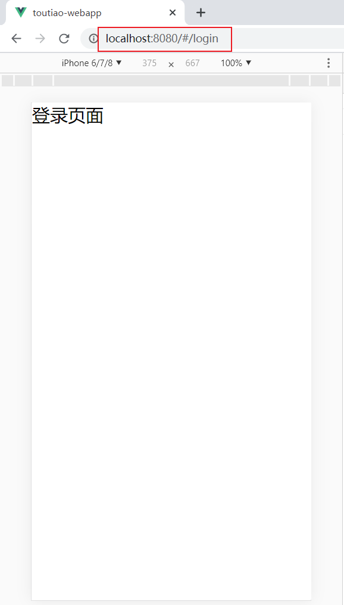
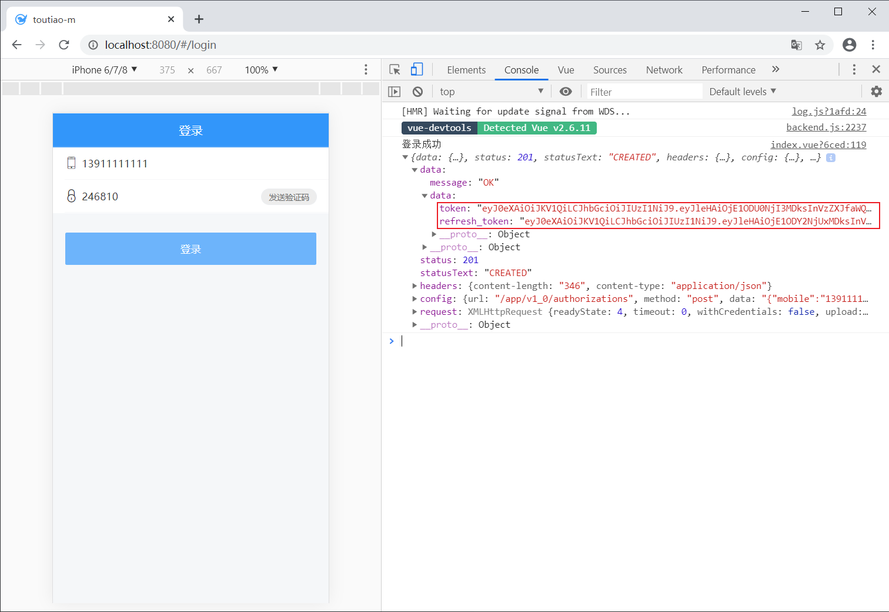
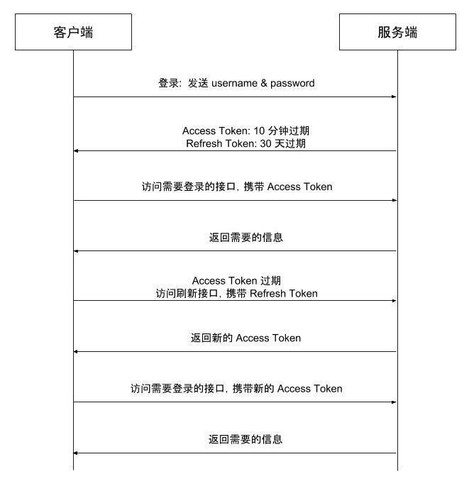

# 二、登录注册

> 目标
> - 能实现登录页面的布局
> - 能实现基本登录功能
> - 能掌握 Vant 中 Toast 提示组件的使用
> - 能理解 API 请求模块的封装
> - 能理解发送验证码的实现思路
> - 能理解 Vant Form 实现表单验证的使用


## 准备

### 创建组件并配置路由

1、创建 `src/views/login/index.vue` 并写入以下内容

```html
<template>
  <div class="login-container">登录页面</div>
</template>

<script>
export default {
  name: 'LoginPage',
  components: {},
  props: {},
  data () {
    return {}
  },
  computed: {},
  watch: {},
  created () {},
  mounted () {},
  methods: {}
}
</script>

<style scoped lang="less"></style>

```

2、然后在 `src/router/index.js` 中配置登录页的路由表

```javascript
{
  path: '/login',
  name: 'login',
  component: () => import('@/views/login')
}
```


最后，访问 `/login` 查看是否能访问到登录页面。




### 布局结构
这里主要使用到三个 Vant 组件：

- [NavBar 导航栏](https://youzan.github.io/vant/#/zh-CN/nav-bar)
- [Form 表单](https://youzan.github.io/vant/#/zh-CN/form)
  - [Field 输入框](https://youzan.github.io/vant/#/zh-CN/field)
  - [Button 按钮](https://youzan.github.io/vant/#/zh-CN/button)

> 一个经验：使用组件库中的现有组件快速布局，再慢慢调整细节，效率更高（刚开始可能会感觉有点麻烦，越用越熟，慢慢的就有了自己的思想）。


### 布局样式

> 写样式的原则：将公共样式写到全局（`src/styles/index.less`），将局部样式写到组件内部。


1、`src/styles/index.less`

```less
body {
  background-color: #f5f7f9;
}

.page-nav-bar {
  background-color: #3296fa;
  .van-nav-bar__title {
    color: #fff;
  }
}
```

2、`src/views/login/index.vue`

```html
<template>
  <div class="login-container">
    <!-- 导航栏 -->
    <van-nav-bar class="page-nav-bar" title="登录" />
    <!-- /导航栏 -->

    <!-- 登录表单 -->
    <van-form @submit="onSubmit">
      <van-field
        name="用户名"
        placeholder="请输入手机号"
      >
        <i slot="left-icon" class="toutiao toutiao-shouji"></i>
      </van-field>
      <van-field
        type="password"
        name="验证码"
        placeholder="请输入验证码"
      >
        <i slot="left-icon" class="toutiao toutiao-yanzhengma"></i>
        <template #button>
          <van-button class="send-sms-btn" round size="small" type="default">发送验证码</van-button>
        </template>
      </van-field>
      <div class="login-btn-wrap">
        <van-button class="login-btn" block type="info" native-type="submit">
          登录
        </van-button>
      </div>
    </van-form>
    <!-- /登录表单 -->
  </div>
</template>

<script>
export default {
  name: 'LoginIndex',
  components: {},
  props: {},
  data () {
    return {
    }
  },
  computed: {},
  watch: {},
  created () {},
  mounted () {},
  methods: {
    onSubmit (values) {
      console.log('submit', values)
    }
  }
}
</script>

<style scoped lang="less">
.login-container {
  .toutiao {
    font-size: 37px;
  }
  .send-sms-btn {
    width: 152px;
    height: 46px;
    line-height: 46px;
    background-color: #ededed;
    font-size: 22px;
    color: #666;
  }
  .login-btn-wrap {
    padding: 53px 33px;
    .login-btn {
      background-color: #6db4fb;
      border: none;
    }
  }
}
</style>
```

## 实现基本登录功能

思路：

- 注册点击登录的事件
- 获取表单数据（根据接口要求使用 v-model 绑定）
- 表单验证
- 发请求提交
- 根据请求结果做下一步处理


**一、根据接口要求绑定获取表单数据**

1、在登录页面组件的实例选项 data 中添加 `user` 数据字段

```javascript
...
data () {
  return {
    user: {
      mobile: '',
      code: ''
    }
  }
}
```

2、在表单中使用 `v-model` 绑定对应数据

```html
<!-- van-cell-group 仅仅是提供了一个上下外边框，能看到包裹的区域 -->
<van-cell-group>
  <van-field
    v-model="user.mobile"
    required
    clearable
    label="手机号"
    placeholder="请输入手机号"
  />

  <van-field
    v-model="user.code"
    type="number"
    label="验证码"
    placeholder="请输入验证码"
    required
  />
</van-cell-group>
```

最后测试。

> 一个小技巧：使用 VueDevtools 调试工具查看是否绑定成功。


**二、请求登录**

1、创建 `src/api/user.js` 封装请求方法

```js
/**
 * 用户相关的请求模块
 */
import request from "@/utils/request"

/**
 * 用户登录
 */
export const login = data => {
  return request({
    method: 'POST',
    url: '/app/v1_0/authorizations',
    data
  })
}
```

2、给登录按钮注册点击事件

```javascript
async onLogin () {
  try {
    const res = await login(this.user)
    console.log('登录成功', res)
  } catch (err) {
    if (err.response.status === 400) {
     	console.log('登录失败', err)
    }
  }
}
```

最后测试。

## 登录状态提示

Vant 中内置了[Toast 轻提示](https://youzan.github.io/vant/#/zh-CN/toast)组件，可以实现移动端常见的提示效果。

```javascript
// 简单文字提示
Toast("提示内容");

// loading 转圈圈提示
Toast.loading({
  duration: 0, // 持续展示 toast
  message: "加载中...",
  forbidClick: true // 是否禁止背景点击
});

// 成功提示
Ttoast.success("成功文案");

// 失败提示
Toast.fail("失败文案");
```

> 提示：在组件中可以直接通过 `this.$toast` 调用。


另外需要注意的是：Toast 默认采用单例模式，即同一时间只会存在一个 Toast，如果需要在同一时间弹出多个 Toast，可以参考下面的示例

```javascript
Toast.allowMultiple();

const toast1 = Toast('第一个 Toast');
const toast2 = Toast.success('第二个 Toast');

toast1.clear();
toast2.clear();
```

下面是为我们的登录功能增加 toast 交互提示。

```javascript
async onLogin () {
  // 开始转圈圈
  this.$toast.loading({
    duration: 0, // 持续时间，0表示持续展示不停止
    forbidClick: true, // 是否禁止背景点击
    message: '登录中...' // 提示消息
  })

  try {
    const res = await request({
      method: 'POST',
      url: '/app/v1_0/authorizations',
      data: this.user
    })
    console.log('登录成功', res)
    // 提示 success 或者 fail 的时候，会先把其它的 toast 先清除
    this.$toast.success('登录成功')
  } catch (err) {
    console.log('登录失败', err)
    this.$toast.fail('登录失败，手机号或验证码错误')
  }
}
```

假如请求非常快的话就看不到 loading 效果了，这里可以手动将调试工具中的网络设置为慢速网络。

测试结束，再把网络设置恢复为 `Online` 正常网络。

## 表单验证

> 参考文档：[Form 表单验证](https://youzan.github.io/vant/#/zh-CN/form#xiao-yan-gui-ze)

```html
<template>
  <div class="login-container">
    <!-- 导航栏 -->
    <van-nav-bar class="page-nav-bar" title="登录" />
    <!-- /导航栏 -->

    <!-- 登录表单 -->
    <!--
      表单验证：
        1、给 van-field 组件配置 rules 验证规则
          参考文档：https://youzan.github.io/vant/#/zh-CN/form#rule-shu-ju-jie-gou
        2、当表单提交的时候会自动触发表单验证
           如果验证通过，会触发 submit 事件
           如果验证失败，不会触发 submit
     -->
    <van-form @submit="onSubmit">
      <van-field
        v-model="user.mobile"
        name="手机号"
        placeholder="请输入手机号"
        :rules="userFormRules.mobile"
        type="number"
        maxlength="11"
      >
        <i slot="left-icon" class="toutiao toutiao-shouji"></i>
      </van-field>
      <van-field
        v-model="user.code"
        name="验证码"
        placeholder="请输入验证码"
        :rules="userFormRules.code"
        type="number"
        maxlength="6"
      >
        <i slot="left-icon" class="toutiao toutiao-yanzhengma"></i>
        <template #button>
          <van-button class="send-sms-btn" round size="small" type="default">发送验证码</van-button>
        </template>
      </van-field>
      <div class="login-btn-wrap">
        <van-button class="login-btn" block type="info" native-type="submit">
          登录
        </van-button>
      </div>
    </van-form>
    <!-- /登录表单 -->
  </div>
</template>

<script>
import { login } from '@/api/user'

export default {
  name: 'LoginIndex',
  components: {},
  props: {},
  data () {
    return {
      user: {
        mobile: '', // 手机号
        code: '' // 验证码
      },
      userFormRules: {
        mobile: [{
          required: true,
          message: '手机号不能为空'
        }, {
          pattern: /^1[3|5|7|8]\d{9}$/,
          message: '手机号格式错误'
        }],
        code: [{
          required: true,
          message: '验证码不能为空'
        }, {
          pattern: /^\d{6}$/,
          message: '验证码格式错误'
        }]
      }
    }
  },
  computed: {},
  watch: {},
  created () {},
  mounted () {},
  methods: {
    async onSubmit () {
      // 1. 获取表单数据
      const user = this.user

      // TODO: 2. 表单验证

      // 3. 提交表单请求登录
      this.$toast.loading({
        message: '登录中...',
        forbidClick: true, // 禁用背景点击
        duration: 0 // 持续时间，默认 2000，0 表示持续展示不关闭
      })

      try {
        const res = await login(user)
        console.log('登录成功', res)
        this.$toast.success('登录成功')
      } catch (err) {
        if (err.response.status === 400) {
          this.$toast.fail('手机号或验证码错误')
        } else {
          this.$toast.fail('登录失败，请稍后重试')
        }
      }

      // 4. 根据请求响应结果处理后续操作
    }
  }
}
</script>

<style scoped lang="less">
.login-container {
  .toutiao {
    font-size: 37px;
  }

  .send-sms-btn {
    width: 152px;
    height: 46px;
    line-height: 46px;
    background-color: #ededed;
    font-size: 22px;
    color: #666;
  }

  .login-btn-wrap {
    padding: 53px 33px;
    .login-btn {
      background-color: #6db4fb;
      border: none;
    }
  }
}
</style>

```


## 验证码处理

### 验证手机号

```js
async onSendSms () {
  console.log('onSendSms')
  // 1. 校验手机号
  try {
    await this.$refs.loginForm.validate('mobile')
  } catch (err) {
    return console.log('验证失败', err)
  }

  // 2. 验证通过，显示倒计时
  // 3. 请求发送验证码
}
```


### 使用倒计时组件

1、在 data 中添加数据用来控制倒计时的显示和隐藏

```javascript
data () {
  return {
    ...
    isCountDownShow: false
  }
}
```

2、使用倒计时组件

```html
<van-field
  v-model="user.code"
  placeholder="请输入验证码"
>
  <i class="icon icon-mima" slot="left-icon"></i>
  <van-count-down
    v-if="isCountDownShow"
    slot="button"
    :time="1000 * 5"
    format="ss s"
    @finish="isCountDownShow = false"
  />
  <van-button
    v-else
    slot="button"
    size="small"
    type="primary"
    round
    @click="onSendSmsCode"
  >发送验证码</van-button>
</van-field>
```

### 发送验证码

1、在 `api/user.js` 中添加封装数据接口

```javascript
export const getSmsCode = mobile => {
  return request({
    method: 'GET',
    url: `/app/v1_0/sms/codes/${mobile}`
  })
}
```

2、给发送验证码按钮注册点击事件

3、发送处理

```javascript
async onSendSms () {
  // 1. 校验手机号
  try {
    await this.$refs.loginForm.validate('mobile')
  } catch (err) {
    return console.log('验证失败', err)
  }

  // 2. 验证通过，显示倒计时
  this.isCountDownShow = true

  // 3. 请求发送验证码
  try {
    await sendSms(this.user.mobile)
    this.$toast('发送成功')
  } catch (err) {
    // 发送失败，关闭倒计时
    this.isCountDownShow = false
    if (err.response.status === 429) {
      this.$toast('发送太频繁了，请稍后重试')
    } else {
      this.$toast('发送失败，请稍后重试')
    }
  }
}
```

## 处理用户 Token



Token 是用户登录成功之后服务端返回的一个身份令牌，在项目中的多个业务中需要使用到：

- 访问需要授权的 API 接口
- 校验页面的访问权限
- ...

但是我们只有在第一次用户登录成功之后才能拿到 Token。

所以为了能在其它模块中获取到 Token 数据，我们需要把它存储到一个公共的位置，方便随时取用。

往哪儿存？

- 本地存储
  - 获取麻烦
  - 数据不是响应式
- Vuex 容器（推荐）
  - 获取方便
  - 响应式的


使用容器存储 Token 的思路：


- 登录成功，将 Token 存储到 Vuex 容器中
  - 获取方便
  - 响应式
- 为了持久化，还需要把 Token 放到本地存储
  - 持久化

下面是具体实现。


1、在 `src/store/index.js` 中

```js
import Vue from 'vue'
import Vuex from 'vuex'

Vue.use(Vuex)

export default new Vuex.Store({
  state: {
    // 用户的登录状态信息
    user: JSON.parse(window.localStorage.getItem('TOUTIAO_USER'))
    // user: null
  },
  mutations: {
    setUser (state, user) {
      state.user = user
      window.localStorage.setItem('TOUTIAO_USER', JSON.stringify(user))
    }
  },
  actions: {
  },
  modules: {
  }
})

```

2、登录成功以后将后端返回的 token 相关数据存储到容器中

```js
async onLogin () {
  // const loginToast = this.$toast.loading({
  this.$toast.loading({
    duration: 0, // 持续时间，0表示持续展示不停止
    forbidClick: true, // 是否禁止背景点击
    message: '登录中...' // 提示消息
  })

  try {
    const res = await login(this.user)

    // res.data.data => { token: 'xxx', refresh_token: 'xxx' }
+    this.$store.commit('setUser', res.data.data)

    // 提示 success 或者 fail 的时候，会先把其它的 toast 先清除
    this.$toast.success('登录成功')
  } catch (err) {
    console.log('登录失败', err)
    this.$toast.fail('登录失败，手机号或验证码错误')
  }

  // 停止 loading，它会把当前页面中所有的 toast 都给清除
  // loginToast.clear()
}
```

## 优化封装本地存储操作模块

创建 `src/utils/storage.js` 模块。

```js
export const getItem = name => {
  const data = window.localStorage.getItem(name)
  try {
    return JSON.parse(data)
  } catch (err) {
    return data
  }
}

export const setItem = (name, value) => {
  if (typeof value === 'object') {
    value = JSON.stringify(value)
  }
  window.localStorage.setItem(name, value)
}

export const removeItem = name => {
  window.localStorage.removeItem(name)
}

```

## 关于 Token 过期问题

登录成功之后后端会返回两个 Token：

- `token`：访问令牌，有效期2小时
- `refresh_token`：刷新令牌，有效期14天，用于访问令牌过期之后重新获取新的访问令牌


我们的项目接口中设定的 `Token` 有效期是 `2 小时`，超过有效期服务端会返回 `401` 表示 Token 无效或过期了。


为什么过期时间这么短？

- 为了安全，例如 Token 被别人盗用


过期了怎么办？

- ~~让用户重新登录~~，用户体验太差了
- 使用 `refresh_token` 解决 `token` 过期


如何使用 `refresh_token` 解决 `token` 过期？

> 到课程的后面我们开发的业务功能丰富起来之后，再给大家讲解 Token 过期处理。
>
> 大家需要注意的是**在学习测试的时候如果收到 401 响应码，请重新登录再测试**。




概述：服务器生成token的过程中，会有两个时间，一个是token失效时间，一个是token刷新时间，刷新时间肯定比失效时间长，当用户的 `token` 过期时，你可以拿着过期的token去换取新的token，来保持用户的登陆状态，当然你这个过期token的过期时间必须在刷新时间之内，如果超出了刷新时间，那么返回的依旧是 401。

处理流程：

1. 在axios的拦截器中加入token刷新逻辑
2. 当用户token过期时，去向服务器请求新的 token
3. 把旧的token替换为新的token
4. 然后继续用户当前的请求

在请求的响应拦截器中统一处理 token 过期：

```js
/**
 * 封装 axios 请求模块
 */
import axios from "axios";
import jsonBig from "json-bigint";
import store from "@/store";
import router from "@/router";

// axios.create 方法：复制一个 axios
const request = axios.create({
  baseURL: "http://ttapi.research.itcast.cn/" // 基础路径
});

/**
 * 配置处理后端返回数据中超出 js 安全整数范围问题
 */
request.defaults.transformResponse = [
  function(data) {
    try {
      return jsonBig.parse(data);
    } catch (err) {
      return {};
    }
  }
];

// 请求拦截器
request.interceptors.request.use(
  function(config) {
    const user = store.state.user;
    if (user) {
      config.headers.Authorization = `Bearer ${user.token}`;
    }
    // Do something before request is sent
    return config;
  },
  function(error) {
    // Do something with request error
    return Promise.reject(error);
  }
);

// 响应拦截器
request.interceptors.response.use(
  // 响应成功进入第1个函数
  // 该函数的参数是响应对象
  function(response) {
    // Any status code that lie within the range of 2xx cause this function to trigger
    // Do something with response data
    return response;
  },
  // 响应失败进入第2个函数，该函数的参数是错误对象
  async function(error) {
    // Any status codes that falls outside the range of 2xx cause this function to trigger
    // Do something with response error
    // 如果响应码是 401 ，则请求获取新的 token

    // 响应拦截器中的 error 就是那个响应的错误对象
    console.dir(error);
    if (error.response && error.response.status === 401) {
      // 校验是否有 refresh_token
      const user = store.state.user;

      if (!user || !user.refresh_token) {
        router.push("/login");

        // 代码不要往后执行了
        return;
      }

      // 如果有refresh_token，则请求获取新的 token
      try {
        const res = await axios({
          method: "PUT",
          url: "http://ttapi.research.itcast.cn/app/v1_0/authorizations",
          headers: {
            Authorization: `Bearer ${user.refresh_token}`
          }
        });

        // 如果获取成功，则把新的 token 更新到容器中
        console.log("刷新 token  成功", res);
        store.commit("setUser", {
          token: res.data.data.token, // 最新获取的可用 token
          refresh_token: user.refresh_token // 还是原来的 refresh_token
        });

        // 把之前失败的用户请求继续发出去
        // config 是一个对象，其中包含本次失败请求相关的那些配置信息，例如 url、method 都有
        // return 把 request 的请求结果继续返回给发请求的具体位置
        return request(error.config);
      } catch (err) {
        // 如果获取失败，直接跳转 登录页
        console.log("请求刷线 token 失败", err);
        router.push("/login");
      }
    }

    return Promise.reject(error);
  }
);

export default request;
```


