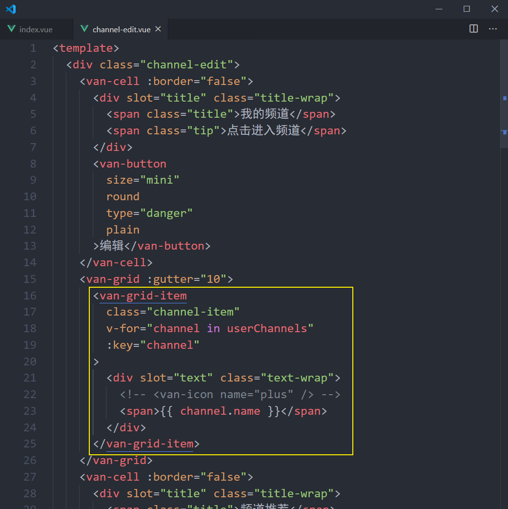
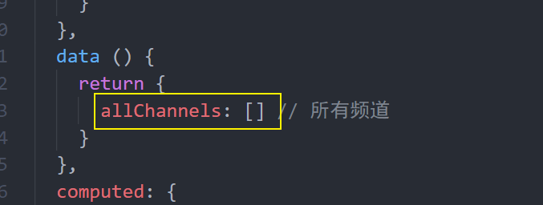
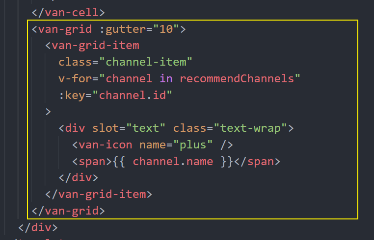
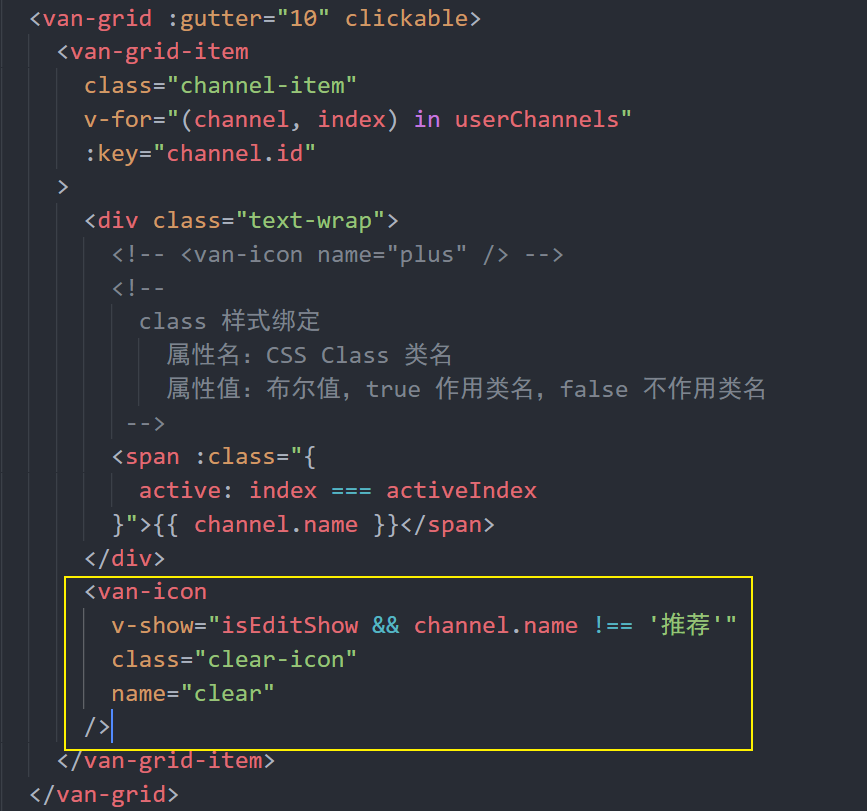
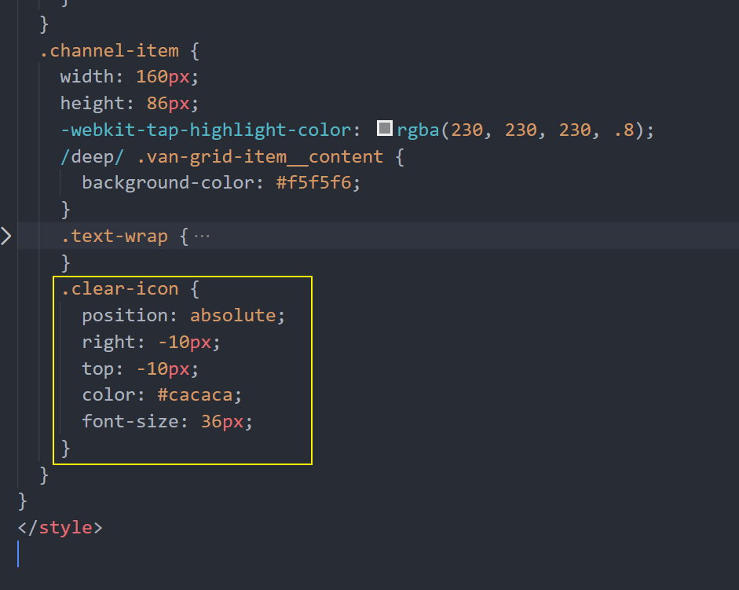
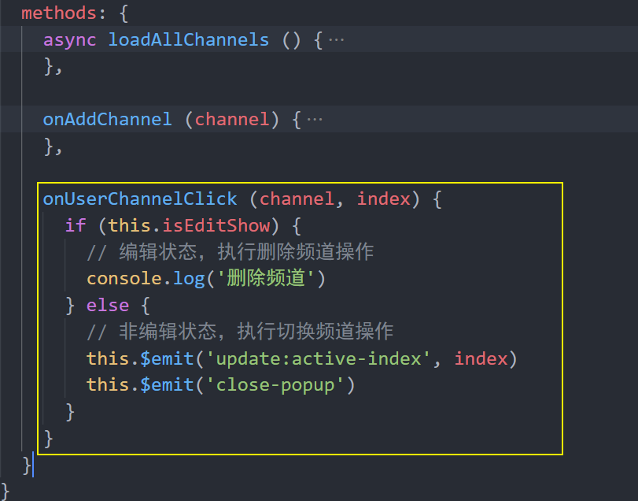
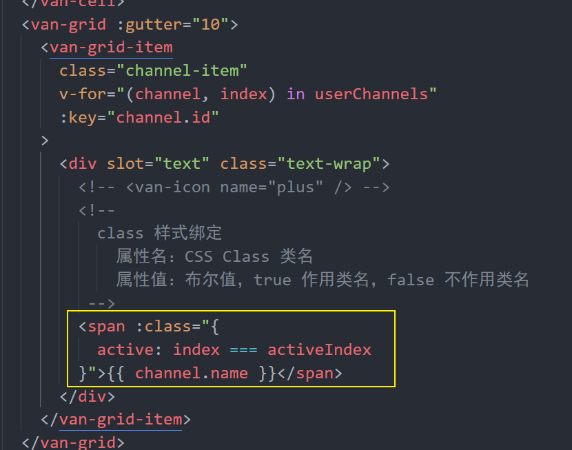

# 五、首页—频道编辑


## 处理页面弹出层

Vant 中内置了 [Popup 弹出层](https://youzan.github.io/vant/#/zh-CN/popup) 组件。

1、在 `data`中添加一个数据用来控制弹层的显示和隐藏

```js
data () {
  return {
    ...
    isChannelEditShow: true // 这里我们先设置为 true 就能看到弹窗的页面了
  }
}
```

2、然后在首页模板中的频道列表后面添加弹出层组件

```html
<!-- 频道编辑 -->
<van-popup
  class="edit-channel-popup"
  v-model="isEditChannelShow"
  position="bottom"
  :style="{ height: '100%' }"
  closeable
  close-icon-position="top-left"
>内容</van-popup>
<!-- /频道编辑 -->
```

```less
.edit-channel-popup {
  padding-top: 100px;
	box-sizing: border-box;
}
```

测试查看结果。

## 创建频道编辑组件

1、创建 `views/home/components/channel-edit.vue`

```html
<template>
  <div class="channel-edit">频道编辑</div>
</template>

<script>
export default {
  name: 'ChannelEdit',
  components: {},
  props: {},
  data () {
    return {}
  },
  computed: {},
  watch: {},
  created () {},
  mounted () {},
  methods: {}
}
</script>

<style scoped lang="less"></style>

```

2、在首页中加载注册

```js
import ChannelEdit from './components/channel-edit'
```

```js
export default {
  ...
  components: {
    ...
    ChannelEdit
  }
}
```


3、在弹出层中使用频道编辑组件

```html
<!-- 频道编辑 -->
<van-popup
  v-model="isChannelEditShow"
  position="bottom"
  closeable
  close-icon-position="top-left"
  :style="{ height: '100%' }"
>
+  <channel-edit />
</van-popup>
<!-- /频道编辑 -->
```


## 页面布局

```html
<template>
  <div class="channel-edit">
    <van-cell title="我的频道" :border="false">
      <van-button
        size="mini"
        round
        type="danger"
        plain
      >编辑</van-button>
    </van-cell>
    <van-grid :gutter="10">
      <van-grid-item
        class="channel-item"
        v-for="value in 8"
        :key="value"
        text="文字"
      />
    </van-grid>
    <van-cell title="频道推荐" :border="false"></van-cell>
    <van-grid :gutter="10">
      <van-grid-item
        class="channel-item"
        v-for="value in 8"
        :key="value"
        text="文字"
      />
    </van-grid>
  </div>
</template>

<script>
export default {
  name: 'ChannelEdit',
  components: {},
  props: {},
  data () {
    return {}
  },
  computed: {},
  watch: {},
  created () {},
  mounted () {},
  methods: {}
}
</script>

<style scoped lang="less">
.channel-edit {
  .channel-item {
    height: 86px;
    /deep/ .van-grid-item__content {
      background-color: #f5f5f6;
      .van-grid-item__text {
        color: #222;
        font-size: 28px;
      }
    }
  }
}
</style>

```


## 展示我的频道

1、在父组件中把 `channels` 传递给频道编辑组件


2、在频道编辑组件中声明接收父组件的 `userChannels` 频道列表数据并遍历展示




## 展示推荐频道列表


没有用来获取推荐频道的数据接口，但是我们有获取所有频道列表的数据接口。

所以：`所有频道列表 - 我的频道 = 剩余推荐的频道`。

实现过程所以一共分为两大步：

- 获取所有频道
- 基于所有频道和我的频道计算获取剩余的推荐频道

### 获取所有频道

1、封装数据接口

```js
/**
 * 获取所有频道
 */
export const getAllChannels = () => {
  return request({
    method: 'GET',
    url: '/app/v1_0/channels'
  })
}
```

2、在编辑频道组件中请求获取所有频道数据




3、在调试工具中测试是否有拿到数据


### 处理展示推荐频道

思路：`所有频道 - 用户频道 = 推荐频道`

1、封装计算属性筛选数据


- 遍历所有频道
- 对每一个频道都判断：该频道是否属于我的频道
- 如果不属于我的频道，则收集起来
- 直到遍历结束，剩下来就是那些剩余的推荐频道


2、模板绑定




## 添加频道


思路：

- 给推荐频道列表中每一项注册点击事件
- 获取点击的频道项
- 将频道项添加到我的频道中
- ~~将当前点击的频道项从推荐频道中移除~~
  - 不需要删除，因为我们获取数据使用的是计算属性，当我频道发生改变，计算属性重新求值了

1、给推荐频道中的频道注册点击事件


2、在添加频道事件处理函数中


然后你会神奇的发现点击的那个推荐频道跑到我的频道中了，我们并没有去手动的删除点击的这个推荐频道，但是它没了！主要是因为推荐频道是通过一个计算属性获取的，计算属性中使用了 channels（我的频道）数据，所以只要我的频道中的数据发生变化，那么计算属性就会重新运算获取最新的数据。

## 编辑频道

思路：

- 给我的频道中的频道项注册点击事件
- 在事件处理函数中
  - 如果是编辑状态，则执行删除频道操作
  - 如果是非编辑状态，则执行切换频道操作

### 处理编辑状态

1、在 data 中添加数据用来控制编辑状态的显示


2、在我的频道项中添加删除图标





3、处理点击编辑按钮


### 切换频道

功能需求：在非编辑器状态下切换频道。

1、给我的频道项注册点击事件


2、处理函数



3、在父组件中监听处理自定义事件


### 让激活频道高亮

思路：

- 将首页中的激活的标签索引传递给频道编辑组件
- 在频道编辑组件中遍历我的频道列表的时候判断遍历项的索引是否等于激活的频道标签索引，如果一样则作用一个高亮的 CSS 类名


1、将首页组件中的 `active` 传递到频道编辑组件中


2、在频道编辑组件中声明 props 接收


3、判断遍历项，如果 `遍历项索引 === active`，则给这个频道项设置高亮样式




### 删除频道

功能需求：在编辑状态下删除频道。


## 频道数据持久化

### 业务分析

频道编辑这个功能，无论用户是否登录用户都可以使用。

不登录也能使用

- 数据存储在本地
- 不支持同步功能

登录也能使用

- 数据存储在线上后台服务器
- 更换不同的设备可以同步数据

### 添加频道

思路：

- 如果未登录，则存储到本地
- 如果已登录，则存储到线上
  - 找到数据接口
  - 封装请求方法
  - 请求调用


1、封装添加频道的请求方法

```js
/**
 * 添加用户频道
 */
export const addUserChannel = channels => {
  return request({
    method: 'PATCH',
    url: '/app/v1_0/user/channels',
    data: {
      channels
    }
  })
}
```

2、修改添加频道的处理逻辑

```js
async onAddChannel (channel) {
  try {
    this.userChannels.push(channel)
    if (this.user) {
      // 已登录，数据存储到线上
      await addUserChannel([{
        id: channel.id, // 频道 id
        seq: this.userChannels.length // 频道的 序号
      }])
    } else {
      // 未登录，数据存储到本地
      setItem('channels', this.userChannels)
    }
  } catch (err) {
    console.log(err)
    this.$toast('添加频道失败')
  }
},
```


### 删除频道

思路：

- 如果未登录，则存储到本地
- 如果已登录，则存储到线上
  - 找到数据接口
  - 封装请求方法
  - 请求调用


1、封装删除用户频道请求方法

```js
/**
 * 删除用户频道
 */
export const deleteUserChannel = channelId => {
  return request({
    method: 'DELETE',
    url: `/app/v1_0/user/channels/${channelId}`
  })
}
```

2、修改删除频道的处理逻辑


```js
async deleteChannel (channel) {
  try {
    if (this.user) {
      // 已登录，将数据存储到线上
      await deleteUserChannel(channel.id)
    } else {
      // 未登录，将数据存储到本地
      setItem('channles', this.userChannels)
    }
  } catch (err) {
    console.log(err)
    this.$toast('删除频道失败，请稍后重试')
  }
}
```


## 正确的获取首页频道列表数据


> 提示：获取登录用户的频道列表和获取默认推荐的频道列表是同一个数据接口。后端会根据接口中的 token 来判定返回数据。

```js
async loadChannels () {
  try {
    let channels = []
    if (this.user) {
      // 已登录，请求获取线上的频道数据
      const { data } = await getChannels()
      channels = data.data.channels
    } else {
      // 未登录
      const localChannels = getItem('channels')
      if (localChannels) {
        // 有本地频道数据，则使用
        channels = localChannels
      } else {
        // 没有本地频道数据，则请求获取默认推荐的频道列表
        const { data } = await getChannels()
        channels = data.data.channels
      }
    }

    // 将数据更新到组件中
    this.channels = channels
  } catch (err) {
    console.log(err)
    this.$toast('数据获取失败')
  }
},
```

