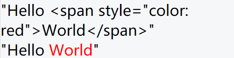

# 六、文章搜索


## 创建组件并配置路由

1、创建 `src/views/search/index.vue`

```html
<template>
  <div class="search-container">搜索页面</div>
</template>

<script>
  export default {
    name: "SearchPage",
    components: {},
    props: {},
    data() {
      return {};
    },
    computed: {},
    watch: {},
    created() {},
    methods: {}
  };
</script>

<style scoped></style>
```

2、然后把搜索页面的路由配置到根组件路由（一级路由）

```js
{
  path: '/search',
  omponent: Search
}
```

最后访问 `/search` 测试。

## 页面布局

1、创建 `src/views/search/components/search-history.vue`

```html
<template>
  <div class="search-history">
    <van-cell title="搜索历史">
      <span>全部删除</span>
      <span>完成</span>
      <van-icon name="delete" />
    </van-cell>
    <van-cell title="hello">
      <van-icon name="close" />
    </van-cell>
    <van-cell title="hello">
      <van-icon name="close" />
    </van-cell>
    <van-cell title="hello">
      <van-icon name="close" />
    </van-cell>
    <van-cell title="hello">
      <van-icon name="close" />
    </van-cell>
  </div>
</template>

<script>
export default {
  name: 'SearchHistory',
  components: {},
  props: {},
  data () {
    return {}
  },
  computed: {},
  watch: {},
  created () {},
  mounted () {},
  methods: {}
}
</script>

<style scoped lang="less"></style>

```

2、创建 `src/views/search/components/search-suggestion.vue`

```html
<template>
  <div class="search-suggestion">
    <van-cell title="黑马程序员..." icon="search"></van-cell>
    <van-cell title="黑马程序员..." icon="search"></van-cell>
    <van-cell title="黑马程序员..." icon="search"></van-cell>
    <van-cell title="黑马程序员..." icon="search"></van-cell>
    <van-cell title="黑马程序员..." icon="search"></van-cell>
  </div>
</template>

<script>
export default {
  name: 'SearchSuggestion',
  components: {},
  props: {},
  data () {
    return {}
  },
  computed: {},
  watch: {},
  created () {},
  mounted () {},
  methods: {}
}
</script>

<style scoped lang="less"></style>

```


3、创建 `src/views/search/components/search-result.vue`

```html
<template>
  <div class="search-result">
    <van-list
      v-model="loading"
      :finished="finished"
      finished-text="没有更多了"
      @load="onLoad"
    >
      <van-cell v-for="item in list" :key="item" :title="item" />
    </van-list>
  </div>
</template>

<script>
export default {
  name: 'SearchResult',
  components: {},
  props: {},
  data () {
    return {
      list: [],
      loading: false,
      finished: false
    }
  },
  computed: {},
  watch: {},
  created () {},
  mounted () {},
  methods: {
    onLoad () {
      // 异步更新数据
      // setTimeout 仅做示例，真实场景中一般为 ajax 请求
      setTimeout(() => {
        for (let i = 0; i < 10; i++) {
          this.list.push(this.list.length + 1)
        }

        // 加载状态结束
        this.loading = false

        // 数据全部加载完成
        if (this.list.length >= 40) {
          this.finished = true
        }
      }, 1000)
    }
  }
}
</script>

<style scoped lang="less"></style>

```


4、搜索组件内容如下：

```html
<template>
  <div class="search-container">
    <!-- 搜索栏 -->
    <!--
      Tips: 在 van-search 外层增加 form 标签，且 action 不为空，即可在 iOS 输入法中显示搜索按钮
     -->
    <form action="/">
      <van-search
        v-model="searchText"
        show-action
        placeholder="请输入搜索关键词"
        background="#3296fa"
        @search="onSearch"
        @cancel="onCancel"
      />
    </form>
    <!-- /搜索栏 -->

    <!-- 搜索历史记录 -->
    <search-history />
    <!-- /搜索历史记录 -->

    <!-- 联想建议 -->
    <search-suggestion />
    <!-- /联想建议 -->

    <!-- 历史记录 -->
    <search-result />
    <!-- /历史记录 -->
  </div>
</template>

<script>
import SearchHistory from './components/search-history'
import SearchSuggestion from './components/search-suggestion'
import SearchResult from './components/search-result'

export default {
  name: 'SearchIndex',
  components: {
    SearchHistory,
    SearchSuggestion,
    SearchResult
  },
  props: {},
  data () {
    return {
      searchText: ''
    }
  },
  computed: {},
  watch: {},
  created () {},
  mounted () {},
  methods: {
    onSearch (val) {
      console.log(val)
    },
    onCancel () {
      this.$router.back()
    }
  }
}
</script>

<style scoped lang="less">
.search-container {
  .van-search__action {
    color: #fff;
  }
}
</style>

```


## 处理页面显示状态

1、在 `data` 中添加数据用来控制搜索结果的显示状态

```js
data () {
  ...
  isResultShow: false
}
```

2、在模板中绑定条件渲染

```html
<!-- 搜索结果 -->
<search-result v-if="isResultShow" />
<!-- /搜索结果 -->

<!-- 联想建议 -->
<search-suggestion v-else-if="searchText" />
<!-- /联想建议 -->

<!-- 搜索历史记录 -->
<search-history v-else />
<!-- /搜索历史记录 -->
```


## 搜索联想建议

基本思路：

- 当搜索框输入内容的时候，请求加载联想建议的数据
- 将请求得到的结果绑定到模板中


### 基本功能

一、将父组件中搜索框输入的内容传给联想建议子组件

二、在子组件中监视搜索框输入内容的变化，如果变化则请求获取联想建议数据

三、将获取到的联想建议数据展示到列表中


### 防抖优化

1、安装 lodash

```sh
# yarn add lodash
npm i lodash
```

2、防抖处理

```js
// lodash 支持按需加载，有利于打包结果优化
import { debounce } from "lodash"
```

> 不建议下面这样使用，因为这样会加载整个模块。
>
> ```js
> import _ from 'lodash'
> _.debounce()
> ```

```js
// debounce 函数
// 参数1：函数
// 参数2：防抖时间
// 返回值：防抖之后的函数，和参数1功能是一样的
onSearchInput: debounce(async function () {
  const searchContent = this.searchContent
  if (!searchContent) {
    return
  }

  // 1. 请求获取数据
  const { data } = await getSuggestions(searchContent)

  // 2. 将数据添加到组件实例中
  this.suggestions = data.data.options

  // 3. 模板绑定
}, 200),
```


### 搜索关键字高亮

如何将字符串中的指定字符在**网页**中高亮展示？

```js
"Hello World";
```

将需要高亮的字符包裹 HTML 标签，为其单独设置颜色。

```js
"Hello <span style="color: red">World</span>"
```

在 Vue 中如何渲染带有 HTML 标签的字符串？

```js
data () {
  return {
    htmlStr: 'Hello <span style="color: red">World</span>'
  }
}
```


```html
<div>{{ htmlStr }}</div>
<div v-html="htmlStr"></div>
```



如何把字符串中指定字符统一替换为高亮（包裹了 HTML）的字符？

```js
const str = "Hello World"

// 结果：<span style="color: red">Hello</span> World
"Hello World".replace('Hello', '<span style="color: red">Hello</span>')

// 需要注意的是，replace 方法的字符串匹配只能替换第1个满足的字符
// <span style="color: red">Hello</span> World Hello abc
"Hello World Hello abc".replace('Hello', '<span style="color: red">Hello</span>')

// 如果想要全文替换，使用正则表达式
// g 全局
// i 忽略大小写
// <span style="color: red">Hello</span> World <span style="color: red">Hello</span> abc
"Hello World Hello abc".replace(/Hello/gi, '<span style="color: red">Hello</span>')
```

> 一个小扩展：使用字符串的 split 结合数组的 join 方法实现高亮
>
> ```js
> var str = "hello world 你好 hello";
>
> // ["", " world 你好 ", ""]
> const arr = str.split("hello");
>
> // "<span>hello</span> world 你好 <span>hello</span>"
> arr.join("<span>hello</span>");
> ```

下面是具体的处理。

1、在 methods 中添加一个方法处理高亮

```js
// 参数 source: 原始字符串
// 参数 keyword: 需要高亮的关键词
// 返回值：替换之后的高亮字符串
highlight (source, keyword) {
  // /searchContent/ 正则表达式中的一切内容都会当做字符串使用
  // 这里可以 new RegExp 方式根据字符串创建一个正则表达式
  // RegExp 是原生 JavaScript 的内置构造函数
  // 参数1：字符串，注意，这里不要加 //
  // 参数2：匹配模式，g 全局，i 忽略大小写
  const reg = new RegExp(keyword, 'gi')
  return source.replace(reg, `<span style="color: #3296fa">${keyword}</span>`)
},
```

2、然后在联想建议列表项中绑定调用

```html
<!-- 联想建议 -->
<van-cell-group v-else-if="searchContent">
  <van-cell
    icon="search"
    v-for="(item, index) in suggestions"
    :key="index"
    @click="onSearch(item)"
  >
    <div slot="title" v-html="highlight(item, searchContent)"></div>
  </van-cell>
</van-cell-group>
<!-- /联想建议 -->
```

## 搜索结果

思路：

- 找到数据接口
- 请求获取数据
- 将数据展示到模板中

一、获取搜索关键字

1、声明接收父组件中的搜索框输入的内容

```js
props: {
  q: {
    type: String,
    require: true
  }
},
```


2、在父组件给子组件传递数据

```html
<!-- 搜索结果 -->
<search-result v-if="isResultShow" :q="searchText" />
<!-- /搜索结果 -->
```


最后在调试工具中查看确认是否接收到 props 数据。


二、请求获取数据

1、在 `api/serach.js` 添加封装获取搜索结果的请求方法

```js
/**
 * 获取搜索结果
 */
export function getSearch(params) {
  return request({
    method: "GET",
    url: "/app/v1_0/search",
    params
  })
}
```

2、请求获取

```js
+ import { getSearch } from '@/api/search'

export default {
  name: 'SearchResult',
  components: {},
  props: {
    q: {
      type: String,
      require: true
    }
  },
  data () {
    return {
      list: [],
      loading: false,
      finished: false,
+      page: 1,
+      perPage: 20
    }
  },
  computed: {},
  watch: {},
  created () {},
  mounted () {},
  methods: {
+++    async onLoad () {
      // 1. 请求获取数据
      const { data } = await getSearch({
        page: this.page, // 页码
        per_page: this.perPage, // 每页大小
        q: this.q // 搜索关键字
      })

      // 2. 将数据添加到列表中
      const { results } = data.data
      this.list.push(...results)

      // 3. 设置加载状态结束
      this.loading = false

      // 4. 判断数据是否加载完毕
      if (results.length) {
        this.page++ // 更新获取下一页数据的页码
      } else {
        this.finished = true // 没有数据了，将加载状态设置结束，不再 onLoad
      }
    }
  }
}
```

三、最后，模板绑定

```html
<van-list
  v-model="loading"
  :finished="finished"
  finished-text="没有更多了"
  @load="onLoad"
>
  <van-cell
+    v-for="(article, index) in list"
+    :key="index"
+    :title="article.title"
  />
</van-list>
```

## 搜索历史记录

### 添加历史记录

当发生搜索的时候我们才需要记录历史记录。

1、在 data 中添加一个数据用来存储历史记录

```js
data () {
  return {
    ...
    searchHistories: []
  }
}
```

2、在触发搜索的时候，记录历史记录

```js
onSearch (val) {
  // 更新文本框内容
  this.searchText = val

  // 存储搜索历史记录
  // 要求：不要有重复历史记录、最新的排在最前面
  const index = this.searchHistories.indexOf(val)
  if (index !== -1) {
    this.searchHistories.splice(index, 1)
  }
  this.searchHistories.unshift(val)

  // 渲染搜索结果
  this.isResultShow = true
},
```


### 展示历史记录

```html
<!-- 历史记录 -->
<van-cell-group v-else>
  <van-cell title="历史记录">
    <van-icon name="delete" />
    <span>全部删除</span>
    &nbsp;&nbsp;
    <span>完成</span>
  </van-cell>
  <van-cell
    :title="item"
    v-for="(item, index) in searchHistories"
    :key="index"
  >
    <van-icon name="close"></van-icon>
  </van-cell>
</van-cell-group>
<!-- /历史记录 -->
```


### 删除历史记录

基本思路：

- 给历史记录中的每一项注册点击事件
- 在处理函数中判断
  - 如果是删除状态，则执行删除操作
  - 如果是非删除状态，则执行搜索操作


一、处理删除相关元素的展示状态

1、在 data 中添加一个数据用来控制删除相关元素的显示状态

```js
data () {
  return {
    ...
    isDeleteShow: false
  }
}
```

2、绑定使用

```html
<!-- 历史记录 -->
<van-cell-group v-else>
  <van-cell title="历史记录">
    <template v-if="isDeleteShow">
      <span @click="searchHistories = []">全部删除</span>
      &nbsp;&nbsp;
      <span @click="isDeleteShow = false">完成</span>
    </template>
    <van-icon v-else name="delete" @click="isDeleteShow = true"></van-icon>
  </van-cell>
  <van-cell
    :title="item"
    v-for="(item, index) in searchHistories"
    :key="index"
    @click="onSearch(item)"
  >
    <van-icon
      v-show="isDeleteShow"
      name="close"
      @click="searchHistories.splice(index, 1)"
    ></van-icon>
  </van-cell>
</van-cell-group>
<!-- /历史记录 -->
```

二、处理删除操作

```html
<!-- 历史记录 -->
<van-cell-group v-else>
  <van-cell title="历史记录">
    <template v-if="isDeleteShow">
+      <span @click="searchHistories = []">全部删除</span>
      &nbsp;&nbsp;
      <span @click="isDeleteShow = false">完成</span>
    </template>
    <van-icon v-else name="delete" @click="isDeleteShow = true" />
  </van-cell>
  <van-cell
    :title="item"
    v-for="(item, index) in searchHistories"
    :key="index"
+    @click="onHistoryClick(item, index)"
  >
    <van-icon v-show="isDeleteShow" name="close"></van-icon>
  </van-cell>
</van-cell-group>
<!-- /历史记录 -->
```

```js
onHistoryClick (item, index) {
  // 如果是删除状态，则执行删除操作
  if (this.isDeleteShow) {
    this.searchHistories.splice(index, 1)
  } else {
    // 否则执行搜索操作
    this.onSearch(item)
  }
}
```

### 数据持久化

1、利用 watch 监视统一存储数据

```js
watch: {
  searchHistories (val) {
    // 同步到本地存储
    setItem('serach-histories', val)
  }
},
```


2、初始化的时候从本地存储获取数据

```js
data () {
  return {
    ...
    searchHistories: getItem('serach-histories') || [],
  }
}
```

