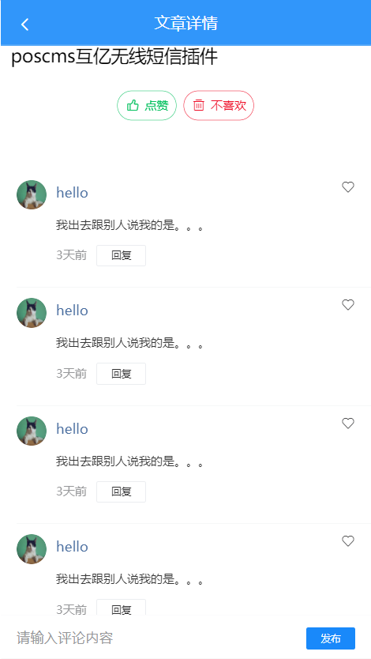

# 八、文章评论

## 展示文章评论列表

### 准备组件

为了更好的开发和维护，这里我们把文章评论单独封装到一个组件中来处理。

1、创建 `src/views/article/components/article-comment.vue`

```html
<template>
  <div class="article-comments">
    <!-- 评论列表 -->
    <van-list
      v-model="loading"
      :finished="finished"
      finished-text="没有更多了"
      @load="onLoad"
    >
      <van-cell v-for="item in list" :key="item" :title="item">
        <van-image
          slot="icon"
          round
          width="30"
          height="30"
          style="margin-right: 10px;"
          src="https://img.yzcdn.cn/vant/cat.jpeg"
        />
        <span style="color: #466b9d;" slot="title">hello</span>
        <div slot="label">
          <p style="color: #363636;">我出去跟别人说我的是。。。</p>
          <p>
            <span style="margin-right: 10px;">3天前</span>
            <van-button size="mini" type="default">回复</van-button>
          </p>
        </div>
        <van-icon slot="right-icon" name="like-o" />
      </van-cell>
    </van-list>
    <!-- 评论列表 -->

    <!-- 发布评论 -->
    <van-cell-group class="publish-wrap">
      <van-field clearable placeholder="请输入评论内容">
        <van-button slot="button" size="mini" type="info">发布</van-button>
      </van-field>
    </van-cell-group>
    <!-- /发布评论 -->
  </div>
</template>

<script>
  export default {
    name: "ArticleComment",
    props: {},
    data() {
      return {
        list: [], // 评论列表
        loading: false, // 上拉加载更多的 loading
        finished: false // 是否加载结束
      };
    },

    methods: {
      onLoad() {
        // 异步更新数据
        setTimeout(() => {
          for (let i = 0; i < 10; i++) {
            this.list.push(this.list.length + 1);
          }
          // 加载状态结束
          this.loading = false;

          // 数据全部加载完成
          if (this.list.length >= 40) {
            this.finished = true;
          }
        }, 500);
      }
    }
  };
</script>

<style scoped lang="less">
  .publish-wrap {
    position: fixed;
    left: 0;
    bottom: 0;
    width: 100%;
  }

  .van-list {
    margin-bottom: 45px;
  }
</style>
```

2、在文章详情页面中加载注册文章评论子组件

```js
import ArticleComment from './components/article-comment'

export default {
  ...
  components: {
    ArticleComment
  }
}
```

3、在文章详情页面的加载失败提示消息后面使用文章评论子组件

```html
<!-- 文章评论 -->
<article-comment />
<!-- /文章评论 -->
```

最终页面效果如下：



### 获取数据并展示

> 提示：有评论数据的文章 id：`139987`。

步骤：

- 封装接口
- 请求获取数据
- 处理模板

实现：

1、在 `api/comment.js` 中添加封装请求方法

```js
/**
 * 评论接口模块
 */
import request from "@/utils/request";

/**
 * 获取文章列表
 */
export function getComments(params) {
  return request({
    method: "GET",
    url: "/app/v1_0/comments",
    params
  });
}
```

2、请求获取数据

```js
data () {
  return {
    ...
    articleComment: { // 文章评论相关数据
      list: [],
      loading: false,
      finished: false,
      offset: null, // 请求下一页数据的页码
      totalCount: 0 // 总数据条数
    }
  }
}
```


```js
async onLoad () {
  const articleComment = this.articleComment
  // 1. 请求获取数据
  const { data } = await getComments({
    type: 'a', // 评论类型，a-对文章(article)的评论，c-对评论(comment)的回复
    source: this.articleId, // 源id，文章id或评论id
    offset: articleComment.offset, // 获取评论数据的偏移量，值为评论id，表示从此id的数据向后取，不传表示从第一页开始读取数据
    limit: 10 // 每页大小
  })

  // 2. 将数据添加到列表中
  const { results } = data.data
  articleComment.list.push(...results)

  // 更新总数据条数
  articleComment.totalCount = data.data.total_count

  // 3. 将加载更多的 loading 设置为 false
  articleComment.loading = false

  // 4. 判断是否还有数据
  if (results.length) {
    articleComment.offset = data.data.last_id // 更新获取下一页数据的页码
  } else {
    articleComment.finished = true // 没有数据了，关闭加载更多
  }
}
```

3、模板绑定

```html
<!-- 评论列表 -->
<van-list
  v-model="loading"
  :finished="finished"
  finished-text="没有更多了"
  @load="onLoad"
>
  <van-cell v-for="item in list" + :key="item.com_id.toString()">
    <van-image
      slot="icon"
      round
      width="30"
      height="30"
      style="margin-right: 10px;"
      +
      :src="item.aut_photo"
    />
    + <span style="color: #466b9d;" slot="title">{{ item.aut_name }}</span>
    <div slot="label">
      +
      <p style="color: #363636;">{{ item.content }}</p>
      <p>
        +
        <span style="margin-right: 10px;"
          >{{ item.pubdate | relativeTime }}</span
        >
        <van-button size="mini" type="default">回复</van-button>
      </p>
    </div>
    <van-icon slot="right-icon" name="like-o" />
  </van-cell>
</van-list>
<!-- 评论列表 -->
```

### 展示文章评论总数量

### 文章评论项

```html
<template>
  <van-cell class="comment-item">
    <van-image
      slot="icon"
      class="avatar"
      round
      fit="cover"
      src="https://img.yzcdn.cn/vant/cat.jpeg"
    />
    <div slot="title" class="title-wrap">
      <div class="user-name">用户名称</div>
      <van-button
        class="like-btn"
        icon="good-job-o"
      >赞</van-button>
    </div>

    <div slot="label">
      <p class="comment-content">这是评论内容</p>
      <div class="bottom-info">
        <span class="comment-pubdate">4天前</span>
        <van-button
          class="reply-btn"
          round
        >回复 0</van-button>
      </div>
    </div>
  </van-cell>
</template>

<script>
export default {
  name: 'CommentItem',
  components: {},
  props: {},
  data () {
    return {}
  },
  computed: {},
  watch: {},
  created () {},
  mounted () {},
  methods: {}
}
</script>

<style scoped lang="less">
.comment-item {
  .avatar {
    width: 72px;
    height: 72px;
    margin-right: 25px;
  }
  .title-wrap {
    display: flex;
    justify-content: space-between;
    align-items: center;
    .user-name {
      color: #406599;
      font-size: 26px;
    }
  }
  .comment-content {
    font-size: 32px;
    color: #222222;
    word-break: break-all;
    text-align: justify;
  }
  .comment-pubdate {
    font-size: 19px;
    color: #222;
    margin-right: 25px;
  }
  .bottom-info {
    display: flex;
    align-items: center;
  }
  .reply-btn {
    width: 135px;
    height: 48px;
    line-height: 48px;
    font-size: 21px;
    color: #222;
  }
  .like-btn {
    height: 30px;
    padding: 0;
    border: none;
    font-size: 19px;
    line-height: 30px;
    margin-right: 7px;
    .van-icon {
      font-size: 30px;
    }
  }
}
</style>

```

绑定之后：

```html
<template>
  <van-cell class="comment-item">
    <van-image
      slot="icon"
      class="avatar"
      round
      fit="cover"
      :src="comment.aut_photo"
    />
    <div slot="title" class="title-wrap">
      <div class="user-name">{{ comment.aut_name }}</div>
      <van-button
        class="like-btn"
        icon="good-job-o"
      >{{ comment.like_count || '赞' }}</van-button>
    </div>

    <div slot="label">
      <p class="comment-content">{{ comment.content }}</p>
      <div class="bottom-info">
        <span class="comment-pubdate">{{ comment.pubdate | relativeTime }}</span>
        <van-button
          class="reply-btn"
          round
        >回复 {{ comment.reply_count }}</van-button>
      </div>
    </div>
  </van-cell>
</template>

<script>
export default {
  name: 'CommentItem',
  components: {},
  props: {
    comment: {
      type: Object,
      required: true
    }
  },
  data () {
    return {}
  },
  computed: {},
  watch: {},
  created () {},
  mounted () {},
  methods: {}
}
</script>

<style scoped lang="less">
.comment-item {
  .avatar {
    width: 72px;
    height: 72px;
    margin-right: 25px;
  }
  .title-wrap {
    display: flex;
    justify-content: space-between;
    align-items: center;
    .user-name {
      color: #406599;
      font-size: 26px;
    }
  }
  .comment-content {
    font-size: 32px;
    color: #222222;
    word-break: break-all;
    text-align: justify;
  }
  .comment-pubdate {
    font-size: 19px;
    color: #222;
    margin-right: 25px;
  }
  .bottom-info {
    display: flex;
    align-items: center;
  }
  .reply-btn {
    width: 135px;
    height: 48px;
    line-height: 48px;
    font-size: 21px;
    color: #222;
  }
  .like-btn {
    height: 30px;
    padding: 0;
    border: none;
    font-size: 19px;
    line-height: 30px;
    margin-right: 7px;
    .van-icon {
      font-size: 30px;
    }
  }
}
</style>

```

## 评论点赞

1、在 `api/comment.js` 中添加封装两个数据接口

```js
/**
 * 对评论或评论回复点赞
 */
export function addCommentLike(commentId) {
  return request({
    method: "POST",
    url: "/app/v1_0/comment/likings",
    data: {
      target: commentId
    }
  });
}

/**
 * 取消对评论或评论回复点赞
 */
export function deleteCommentLike(commentId) {
  return request({
    method: "DELETE",
    url: `/app/v1_0/comment/likings/${commentId}`
  });
}
```

2、然后给评论项中的 `like` 图标注册点击事件

```html
<van-icon
  slot="right-icon"
  color="red"
  +
  :name="item.is_liking ? 'like' : 'like-o'"
  +
  @click="onCommentLike(item)"
/>
```

3、在事件处理函数中

```js
import {
  getComments,
  addComment,
+  addCommentLike,
+  deleteCommentLike
} from '@/api/comment'
```

```js
async onCommentLike (comment) {
  // 如果已经赞了则取消点赞
  if (comment.is_liking) {
    await deleteCommentLike(comment.com_id)
  } else {
    // 如果没有赞，则点赞
    await addCommentLike(comment.com_id)
  }

  // 更新视图状态
  comment.is_liking = !comment.is_liking
  this.$toast('操作成功')
}
```

## 发布文章评论

### 准备弹出层

### 封装组件

```html
<template>
  <div class="comment-post">
    <van-field
      class="post-field"
      v-model="message"
      rows="2"
      autosize
      type="textarea"
      maxlength="50"
      placeholder="请输入留言"
      show-word-limit
    />
    <van-button
      class="post-btn"
    >发布</van-button>
  </div>
</template>

<script>
export default {
  name: 'CommentPost',
  components: {},
  props: {},
  data () {
    return {
      message: ''
    }
  },
  computed: {},
  watch: {},
  created () {},
  mounted () {},
  methods: {}
}
</script>

<style scoped lang="less">
.comment-post {
  display: flex;
  align-items: center;
  padding: 32px 0 32px 32px;
  .post-field {
    background-color: #f5f7f9;
  }
  .post-btn {
    width: 150px;
    border: none;
    padding: 0;
    color: #6ba3d8;
    &::before {
      display: none;
    }
  }
}
</style>

```


步骤：

- 注册发布点击事件
- 请求提交表单
- 根据响应结果进行后续处理

一、使用弹层展示发布评论

1、添加弹层组件

```js
data () {
  return {
    ...
    isPostShow: false
  }
}
```

```html
<!-- 发布文章评论 -->
<van-popup
  v-model="isPostShow"
  position="bottom"
/>
<!-- /发布文章评论 -->
```

> 提示：不设置高度的时候，内容会自动撑开弹层高度

2、点击发评论按钮的时候显示弹层

```html
<van-button
  class="write-btn"
  type="default"
  round
  size="small"
  @click="isPostShow = true"
>写评论</van-button>
```

二、封装发布评论组件

1、创建 `post-comment.vue`

```html
<template>
  <div class="post-comment">
    <van-field
      class="post-field"
      v-model="message"
      rows="2"
      autosize
      type="textarea"
      maxlength="50"
      placeholder="优质评论将会被优先展示"
      show-word-limit
    />
    <van-button
      type="primary"
      size="small"
    >发布</van-button>
  </div>
</template>

<script>
export default {
  name: 'PostComment',
  components: {},
  props: {},
  data () {
    return {
      message: ''
    }
  },
  computed: {},
  watch: {},
  created () {},
  mounted () {},
  methods: {}
}
</script>

<style scoped lang="less">
.post-comment {
  display: flex;
  padding: 15px;
  align-items: flex-end;
  .post-field {
    background: #f5f7f9;
    margin-right: 15px;
  }
}
</style>

```

2、在详情页加载注册

3、在发布评论的弹层中使用

```html
<!-- 发布文章评论 -->
<van-popup
  v-model="isPostShow"
  position="bottom"
>
  <post-comment />
</van-popup>
<!-- /发布文章评论 -->
```

三、发布评论

1、在 `api/comment.js` 中添加封装数据接口

```js
/**
 * 添加评论或评论回复
 */
export function addComment(data) {
  return request({
    method: "POST",
    url: "/app/v1_0/comments",
    data
  });
}
```

2、绑定获取添加评论的输入框数据并且注册发布按钮的点击事件

```js
data () {
  return {
    ...
    inputComment: ''
  }
}
```

```html
<!-- 发布评论 -->
<van-cell-group class="publish-wrap">
  <van-field + v-model="inputComment" clearable placeholder="请输入评论内容">
    <van-button slot="button" size="mini" type="info" + @click="onAddComment"
      >发布</van-button
    >
  </van-field>
</van-cell-group>
<!-- /发布评论 -->
```

3、在事件处理函数中

```js
import {
	getComments,
+  addComment
} from '@/api/comment'
```

```js
async onAddComment () {
  const inputComment = this.inputComment.trim()

  // 非空校验
  if (!inputComment.length) {
    return
  }

  // 请求添加
  const res = await addComment({
    target: this.$route.params.articleId, // 评论的目标id（评论文章即为文章id，对评论进行回复则为评论id）
    content: inputComment // 评论内容
    // art_id // 文章id，对评论内容发表回复时，需要传递此参数，表明所属文章id。对文章进行评论，不要传此参数。
  })

  // 将发布的最新评论展示到列表顶部
  this.list.unshift(res.data.data.new_obj)

  // 清空文本框
  this.inputComment = ''
}
```

### 请求发布

基本思路：

- 找到数据接口
- 封装请求方法
- 注册发布点击事件
  - 请求发布
  - 成功：将发布的内容展示到列表中
  - 失败：提示失败


1、封装数据接口

```js
/**
 * 发布评论
 */
export const addComment = data => {
  return request({
    method: 'POST',
    url: '/app/v1_0/comments',
    data
  })
}
```


2、给发布按钮点击事件

3、事件处理函数

```js
async onAddComment () {
  // 1. 拿到数据
  const postMessage = this.postMessage

  // 非空校验
  if (!postMessage) {
    return
  }

  this.$toast.loading({
    duration: 0, // 持续展示 toast
    message: '发布中...',
    forbidClick: true // 是否禁止背景点击
  })

  try {
    // 2. 请求提交
    const { data } = await addComment({
      target: this.articleId, // 评论的目标id（评论文章即为文章id，对评论进行回复则为评论id）
      content: postMessage
      // art_id: // 文章id，对评论内容发表回复时，需要传递此参数，表明所属文章id。对文章进行评论，不要传此参数。
    })

    // 关闭发布评论的弹层
    this.isPostShow = false

    // 将最新发布的评论展示到列表的顶部
    this.articleComment.list.unshift(data.data.new_obj)

    // 更新文章评论的总数量
    this.articleComment.totalCount++

    // 清空文本框
    this.postMessage = ''

    this.$toast.success('发布成功')
  } catch (err) {
    console.log(err)
    this.$toast.fail('发布失败')
  }
}
```

### 发布成功处理

## 评论回复

### 准备回复弹层

一、在详情页中使用弹层用来展示文章的回复

1、在 data 中添加数据用来控制展示回复弹层的显示状态

```js
data () {
  return {
    ...
    isReplyShow: false
  }
}
```

2、在详情页中添加使用弹层组件

```html
<!-- 评论回复 -->
<van-popup
  v-model="isReplyShow"
  position="bottom"
  style="height: 95%"
>
  评论回复
</van-popup>
<!-- /评论回复 -->
```

二、当点击评论项组件中的回复按钮的时候展示弹层

1、在 `comment-item.vue` 组件中点击回复按钮的时候，对外发布自定义事件

```php+HTML
<van-button
  size="mini"
  type="default"
  @click="$emit('click-reply')"
>回复 {{ comment.reply_count }}</van-button>
```

2、在详情页组件中使用的位置监听处理

```html
<comment-item
  v-for="(comment, index) in articleComment.list"
  :key="index"
  :comment="comment"
  @click-reply="isReplyShow = true"
/>
```

### 点击回复显示弹出层

### 封装内容组件

```html
<template>
  <div class="comment-reply">
    <!-- 导航栏 -->
    <van-nav-bar :title="`${comment.reply_count}条回复`">
      <van-icon
        slot="left"
        name="cross"
        @click="$emit('click-close')"
      />
    </van-nav-bar>
    <!-- /导航栏 -->

    <!-- 当前评论项 -->
    <!-- /当前评论项 -->

    <van-cell title="所有回复" />

    <!-- 评论的回复列表 -->
    <!-- /评论的回复列表 -->

    <!-- 底部 -->
    <!-- /底部 -->
  </div>
</template>

<script>
export default {
  name: 'CommentReply',
  components: {},
  props: {},
  data () {
    return {}
  },
  computed: {},
  watch: {},
  created () {},
  mounted () {},
  methods: {}
}
</script>

<style scoped></style>

```

### 传递当前点击回复的评论项

### 处理头部

### 处理当前评论项

一、让 `comment-reply.vue` 组件拿到点击回复的评论对象

1、在 `comment-item.vue` 组件中点击回复按钮的时候把评论对象给传出来

```html
<van-button
  size="mini"
  type="default"
  @click="$emit('click-reply', comment)"
>回复 {{ comment.reply_count }}</van-button>
```

2、在文章详情组件中接收处理

```js
data () {
  return {
    ...
    currentComment: {} // 点击回复的那个评论对象
  }
}
```

```html
<comment-item
  v-for="(comment, index) in articleComment.list"
  :key="index"
  :comment="comment"
  @click-reply="onReplyShow"
/>
```

```js
async onReplyShow (comment) {
  // 将子组件中传给我评论对象存储到当前组件
  this.currentComment = comment
  
  // 展示评论回复弹层
  this.isReplyShow = true
}
```

3、在详情组件中将 `currentComment` 传递给 `comment-reply.vue` 组件

```html
<!-- 评论回复 -->
<van-popup
  v-model="isReplyShow"
  position="bottom"
  style="height: 95%"
>
  <comment-reply
    @click-close="isReplyShow = false"
    :comment="currentComment"
  />
</van-popup>
<!-- /评论回复 -->
```

4、在 `comment-reply.vue` 组件中声明接收

```js
props: {
  comment: {
    type: Object,
    required: true
  }
},
```

最后使用调试工具查看 props 数据是否接收正确。

二、在 `comment-reply.vue` 组件中展示当前评论

1、加载注册 `comment-item.vue` 组件

2、使用展示

```html
<template>
  <div class="comment-reply">
    <!-- 导航栏 -->
    <van-nav-bar :title="`${comment.reply_count}条回复`">
      <van-icon
        slot="left"
        name="cross"
        @click="$emit('click-close')"
      />
    </van-nav-bar>
    <!-- /导航栏 -->

    <!-- 当前评论项 -->
    <comment-item :comment="comment" />
    <!-- /当前评论项 -->

    <!-- 评论的回复列表 -->
    <!-- /评论的回复列表 -->

    <!-- 底部 -->
    <!-- /底部 -->
  </div>
</template>
```


一：把点击回复的评论对象传递给评论回复组件

1、在 data 中添加一个数据用来存储点击回复的评论对象

```js
data () {
  return {
    ...
    currentComment: {} // 存储当前点击回复的评论对象
  }
}
```

2、在点击回复的处理函数中评论对象存储到数据中

```js
async onReplyShow (comment) {
+  this.currentComment = comment
  // 显示回复的弹层
  this.isReplyShow = true
}
```

3、把当前组件的 `currentComment` 传递给评论回复组件

```html
<!-- 评论回复 -->
<van-popup
  v-model="isReplyShow"
  get-container="body"
  round
  position="bottom"
  :style="{ height: '90%' }"
>
  <!-- 回复列表 -->
  + <comment-reply :comment="currentComment" />
  <!-- /回复列表 -->
</van-popup>
<!-- 评论回复 -->
```

4、在评论回复组件中声明 `props` 接收数据

```js
props: {
  comment: {
    type: Object,
    required: true
  }
},
```

测试：点击不同的评论回复按钮，查看子组件中的 props 数据 `comment` 是否是当前点击回复所在的评论对象。

二、数据绑定：在评论回复组件中展示当前评论

```html
<!-- 导航栏 -->
+
<van-nav-bar :title="comment.reply_count + '条回复'">
  <van-icon slot="left" name="cross" />
</van-nav-bar>
<!-- /导航栏 -->

<!-- 当前评论 -->
<van-cell title="当前评论">
  <van-image
    slot="icon"
    round
    width="30"
    height="30"
    style="margin-right: 10px;"
    :src="comment.aut_photo"
  />
  + <span style="color: #466b9d;" slot="title">{{ comment.aut_name }}</span>
  <div slot="label">
    +
    <p style="color: #363636;">{{ comment.content }}</p>
    <p>
      +
      <span style="margin-right: 10px;"
        >{{ comment.pubdate | relativeTime }}</span
      >
      <van-button size="mini" type="default" +
        >回复 {{ comment.reply_count }}</van-button
      >
    </p>
  </div>
  <van-icon slot="right-icon" />
</van-cell>
<!-- /当前评论 -->
```

### 展示评论回复列表

基本思路：

- 回复列表和文章的评论列表几乎是一样的
- 重用把之前封装的评论列表

```html
<template>
  <div class="comment-reply">
    <!-- 导航栏 -->
    <van-nav-bar :title="`${comment.reply_count}条回复`">
      <van-icon
        slot="left"
        name="cross"
        @click="$emit('click-close')"
      />
    </van-nav-bar>
    <!-- /导航栏 -->

    <!-- 当前评论项 -->
    <comment-item :comment="comment" />
    <!-- /当前评论项 -->

    <van-cell title="所有回复" />

    <!-- 评论的回复列表 -->
    <van-list
      v-model="loading"
      :finished="finished"
      finished-text="没有更多了"
      @load="onLoad"
    >
      <comment-item
        v-for="(comment, index) in list"
        :key="index"
        :comment="comment"
      />
    </van-list>
    <!-- /评论的回复列表 -->

    <!-- 底部 -->
    <!-- /底部 -->
  </div>
</template>

<script>
import CommentItem from './comment-item'
import { getComments } from '@/api/comment'

export default {
  name: 'CommentReply',
  components: {
    CommentItem
  },
  props: {
    comment: {
      type: Object,
      required: true
    }
  },
  data () {
    return {
      list: [],
      loading: false,
      finished: false,
      offset: null,
      limit: 20
    }
  },
  computed: {},
  watch: {},
  created () {},
  mounted () {},
  methods: {
    async onLoad () {
      // 1. 请求获取数据
      const { data } = await getComments({
        type: 'c', // 评论类型，a-对文章(article)的评论，c-对评论(comment)的回复
        source: this.comment.com_id.toString(), // 源id，文章id或评论id
        offset: this.offset, // 获取评论数据的偏移量，值为评论id，表示从此id的数据向后取，不传表示从第一页开始读取数据
        limit: this.limit // 获取的评论数据个数，不传表示采用后端服务设定的默认每页数据量
      })

      // 2. 将数据添加到列表中
      const { results } = data.data
      this.list.push(...results)

      // 3. 关闭 loading
      this.loading = false

      // 4. 判断数据是否加载完毕
      if (results.length) {
        this.offset = data.data.last_id
      } else {
        this.finished = true
      }
    }
  }
}
</script>

<style scoped></style>

```


### 解决弹层中组件内容不更新问题

弹层组件：

- 如果初始的条件是 false，则弹层的内容不会渲染
- 程序运行期间，当条件变为 true 的时候，弹层才渲染了内容
- 之后切换弹层的展示，弹层只是通过 CSS 控制隐藏和显示

弹层渲染出来以后就只是简单的切换显示和隐藏，里面的内容也不再重新渲染了，所以会导致我们的评论的回复列表不会动态更新了。解决办法就是在每次弹层显示的时候重新渲染组件。

```html
<!-- 评论回复 -->
<van-popup
  v-model="isReplyShow"
  get-container="body"
  round
  position="bottom"
  :style="{ height: '90%' }"
>
  <!-- 回复列表 -->
  <comment-reply :comment="currentComment" + v-if="isReplyShow" />
  <!-- /回复列表 -->
</van-popup>
<!-- 评论回复 -->
```

### 发布回复

