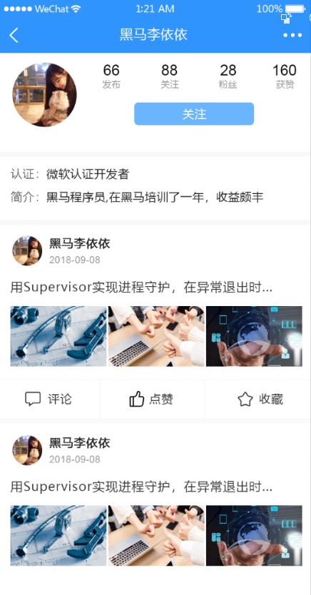

# 九、用户页面

> 该模块作为学生作业，不讲解，仅供源码参考。




## 创建组件并配置路由

1、创建 `views/user/index.vue`

```html
<template>
  <div class="user-container">用户页面</div>
</template>

<script>
export default {
  name: 'UserPage',
  components: {},
  props: {},
  data () {
    return {}
  },
  computed: {},
  watch: {},
  created () {},
  mounted () {},
  methods: {}
}
</script>

<style scoped></style>

```

2、配置到根路由

```js
{
  path: '/user/:userId',
  name: 'user',
  component: () => import('@/views/user')
}
```

最后访问 `/user/用户ID` 测试。

## 页面布局

```html
<template>
  <div class="user-container">
    <!-- 导航栏 -->
    <van-nav-bar
      class="page-nav-bar"
      left-arrow
      title="用户名"
      @click-left="$router.back()"
    ></van-nav-bar>
    <!-- /导航栏 -->

    <div class="user-info">
      <div class="base-info">
        <van-image
          class="avatar"
          round
          fit="cover"
          src="https://img.yzcdn.cn/vant/cat.jpeg"
        />
        <div class="right-area">
          <div class="stats-wrap">
            <div class="stats-item">
              <span class="count">66</span>
              <span class="text">发布</span>
            </div>
            <div class="stats-item">
              <span class="count">88</span>
              <span class="text">关注</span>
            </div>
            <div class="stats-item">
              <span class="count">28</span>
              <span class="text">粉丝</span>
            </div>
            <div class="stats-item">
              <span class="count">160</span>
              <span class="text">获赞</span>
            </div>
          </div>
          <van-button class="follow-btn">关注</van-button>
        </div>
      </div>
      <div class="label-info">
        <div class="bio-wrap">
          <span class="label">简介：</span>
          <span class="text">这是用户简介</span>
        </div>
      </div>
    </div>
  </div>
</template>

<script>
export default {
  name: 'UserIndex',
  components: {},
  props: {
    userId: {
      type: [Number, String, Object],
      required: true
    }
  },
  data () {
    return {}
  },
  computed: {},
  watch: {},
  created () {},
  mounted () {},
  methods: {}
}
</script>

<style scoped lang="less">
.user-container {
  .user-info {
    background-color: #fff;
    padding: 25px 32px;
    .base-info {
      display: flex;
      margin-bottom: 25px;
      .avatar {
        width: 155px;
        height: 155px;
        margin-right: 62px;
      }
    }
    .label-info {
      font-size: 25px;
      .bio-wrap {
        .label {
          color: #646263;
        }
        .text {
          color: #212121;
        }
      }
    }
  }
  .right-area {
    flex: 1;
    display: flex;
    flex-direction: column;
    justify-content: space-evenly;
    .stats-wrap {
      display: flex;
      justify-content: space-between;
      .stats-item {
        display: flex;
        flex-direction: column;
        justify-content: center;
        align-items: center;
        .count {
          font-size: 26px;
          color: #0d0a10;
        }
        .text {
          font-size: 21px;
          color: #9c9b9d;
        }
      }
    }
    .follow-btn {
      width: 289px;
      height: 55px;
      line-height: 55px;
      background-color: #6bb5ff;
      color: #fff;
      border: none;
    }
  }
}
</style>

```


```html
<template>
  <div class="user-container">
    <!-- 导航栏 -->
    <van-nav-bar title="黑马头条号" left-arrow />
    <!-- /导航栏 -->

    <!-- 用户信息 -->
    <div class="user-info-container">
      <div class="row1">
        <van-image
          class="col1"
          fit="cover"
          round
          src="https://img.yzcdn.cn/vant/cat.jpeg"
        />
        <div class="col2">
          <div class="row1">
            <div class="item">
              <div class="count">123</div>
              <div class="text">发布</div>
            </div>
            <div class="item">
              <div class="count">123</div>
              <div class="text">关注</div>
            </div>
            <div class="item">
              <div class="count">123</div>
              <div class="text">粉丝</div>
            </div>
            <div class="item">
              <div class="count">123</div>
              <div class="text">获赞</div>
            </div>
          </div>
          <div class="action">
            <van-button
              type="primary"
              size="small"
            >私信</van-button>
            <van-button
              type="default"
              size="small"
            >编辑资料</van-button>
          </div>
        </div>
      </div>
      <div class="intro-wrap">
        <div>
          <span>认证：</span>
          <span>用户的认证信息</span>
        </div>
        <div>
          <span>简介：</span>
          <span>用户的简介信息</span>
        </div>
      </div>
    </div>
    <!-- /用户信息 -->

    <!-- 文章列表 -->
    <!-- /文章列表 -->
  </div>
</template>

<script>
export default {
  name: 'UserPage',
  components: {},
  props: {},
  data () {
    return {}
  },
  computed: {},
  watch: {},
  created () {},
  mounted () {},
  methods: {}
}
</script>

<style scoped lang="less">
.user-container {
  font-size: 14px;
  .user-info-container {
    padding: 12px;
    background-color: #fff;
    margin-bottom: 10px;
    >.row1 {
      display: flex;
      justify-content: space-between;
      align-items: center;
      margin-bottom: 10px;
      .item {
        text-align: center;
        .text {
          font-size: 12px;
        }
      }
      >.col1 {
        width: 80px;
        height: 80px;
      }
      >.col2 {
        display: flex;
        flex-direction: column;
        justify-content: space-evenly;
        width: 70%;
        height: 80px;
        padding: 0 12px;
        >.row1 {
          display: flex;
          justify-content: space-between;
        }
        .action {
          display: flex;
          justify-content: space-between;
          .van-button {
            width: 45%;
          }
        }
      }
    }
  }
}
</style>

```

## 展示用户信息

步骤：

- 封装数据接口
- 请求获取数据
- 模板绑定

1、在 `api/user.js` 中添加获取指定用户信息的数据接口

```js
// 获取指定用户信息
export const getUserById = userId => {
  return request({
    method: 'GET',
    url: `/app/v1_0/users/${userId}`
  })
}
```

2、在用户页面中请求获取数据

```js
+ import { getUserById } from '@/api/user'

export default {
  name: 'UserPage',
  components: {},
  props: {},
  data () {
    return {
+      user: {} // 用户信息
    }
  },
  computed: {},
  watch: {},
  created () {
+    this.loadUser()
  },
  mounted () {},
  methods: {
+++    async loadUser () {
      try {
        const { data } = await getUserById(this.$route.params.userId)
        this.user = data.data
      } catch (err) {
        console.log(err)
        this.$toast('获取用户数据失败')
      }
    }
  }
}
```

3、模板绑定

## 用户关注

## 展示用户文章列表

### 列表组件

```
<van-list
  v-model="loading"
  :finished="finished"
  finished-text="没有更多了"
  @load="onLoad"
>
  <van-cell
    v-for="item in list"
    :key="item"
    :title="item"
  />
</van-list>
export default {
  data() {
    return {
      list: [],
      loading: false,
      finished: false
    };
  },

  methods: {
    onLoad() {
      // 异步更新数据
      setTimeout(() => {
        for (let i = 0; i < 10; i++) {
          this.list.push(this.list.length + 1);
        }
        // 加载状态结束
        this.loading = false;

        // 数据全部加载完成
        if (this.list.length >= 40) {
          this.finished = true;
        }
      }, 500);
    }
  }
}
```


### 分析列表组件使用

List 的运行机制是什么？

```
List 会监听浏览器的滚动事件并计算列表的位置，当列表底部与可视区域的距离小于offset时，List 会触发一次 load 事件。
```

为什么 List 初始化后会立即触发 load 事件？

```
List 初始化后会触发一次 load 事件，用于加载第一屏的数据，这个特性可以通过`immediate-check`属性关闭。
```

为什么会连续触发 load 事件？

```
如果一次请求加载的数据条数较少，导致列表内容无法铺满当前屏幕，List 会继续触发 load 事件，直到内容铺满屏幕或数据全部加载完成。因此你需要调整每次获取的数据条数，理想情况下每次请求获取的数据条数应能够填满一屏高度。
```

loading 和 finished 分别是什么含义？

> `List`有以下三种状态，理解这些状态有助于你正确地使用`List`组件：
>
> - 非加载中，`loading`为`false`，此时会根据列表滚动位置判断是否触发`load`事件（列表内容不足一屏幕时，会直接触发）
> - 加载中，`loading`为`true`，表示正在发送异步请求，此时不会触发`load`事件
> - 加载完成，`finished`为`true`，此时不会触发`load`事件
>
> 在每次请求完毕后，需要手动将`loading`设置为`false`，表示本次 load 加载结束

使用 float 布局后一直触发加载？

```
若 List 的内容使用了 float 布局，可以在容器上添加van-clearfix类名来清除浮动，使得 List 能正确判断元素位置
```

### 展示文章列表

1、封装获取用户文章列表的数据接口

```js
/**
 * 获取指定用户的文章列表
 */
export const getArticlesByUser = (userId, params) => {
  return request({
    method: 'GET',
    url: `/app/v1_0/users/${userId}/articles`,
    params
  })
}
```

2、在用户页面中请求获取数据

```js
import { getUserById } from '@/api/user'
+ import { getArticlesByUser } from '@/api/article'

export default {
  name: 'UserPage',
  components: {},
  props: {},
  data () {
    return {
      user: {}, // 用户信息
      list: [], // 列表数据
      loading: false, // 控制上拉加载更多的 loading
      finished: false, // 控制是否加载结束了
+      page: 1 // 获取下一页数据的页码
    }
  },
  computed: {},
  watch: {},
  created () {
    this.loadUser()
  },
  mounted () {},
  methods: {
    async loadUser () {
      try {
        const { data } = await getUserById(this.$route.params.userId)
        this.user = data.data
      } catch (err) {
        console.log(err)
        this.$toast('获取用户数据失败')
      }
    },

+++    async onLoad () {
      // 1. 请求获取数据
      const { data } = await getArticlesByUser(this.$route.params.userId, {
        page: this.page, // 可选的，默认是第 1 页
        per_page: 20 // 可选的，默认每页 10 条
      })

      // 2. 把数据添加到列表中
      // list []
      // data.data.results []
      // ...[1, 2, 3] 会把数组给展开，所谓的展开就是一个一个的拿出来
      const { results } = data.data
      this.list.push(...results)

      // 3. 加载状态结束
      this.loading = false

      // 4. 判断数据是否全部加载完毕
      if (results.length) {
        this.page++ // 更新获取下一页数据的页码
      } else {
        this.finished = true // 没有数据了，不需要加载更多了
      }
    }
  }
}
```


