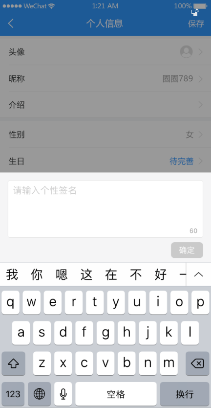
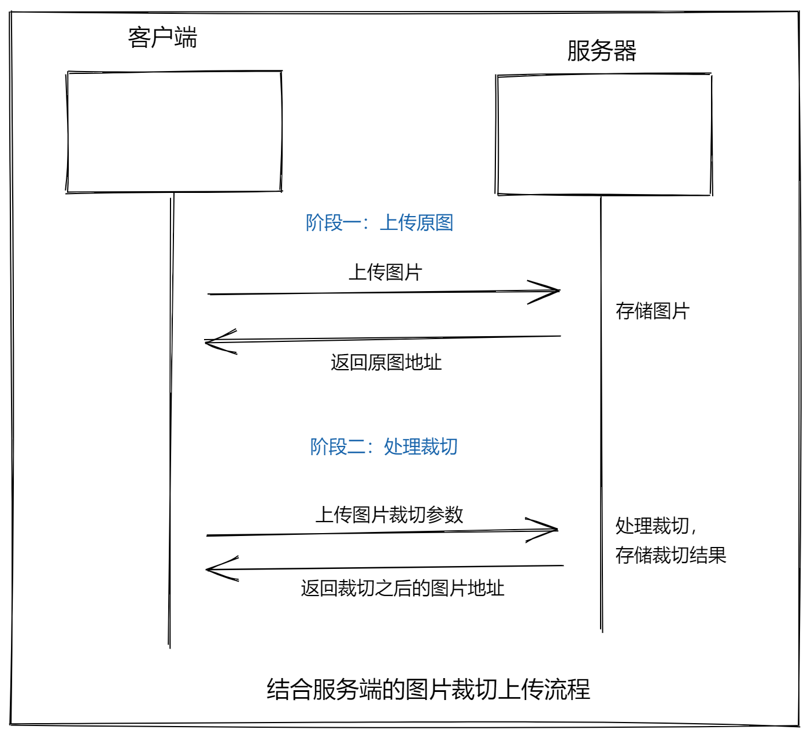

# 十二、编辑用户资料




## 创建组件并配置路由

1、创建 `views/user/index.vue`

```html
<template>
  <div>
    <van-nav-bar title="个人信息" left-arrow right-text="保存" />
    <van-cell-group>
      <van-cell title="头像" is-link>
        <van-image
          round
          width="30"
          height="30"
          fit="cover"
          src="http://toutiao.meiduo.site/FgSTA3msGyxp5-Oufnm5c0kjVgW7"
        />
      </van-cell>
      <van-cell title="昵称" value="abc" is-link />
      <van-cell title="性别" value="男" is-link />
      <van-cell title="生日" value="2019-9-27" is-link />
    </van-cell-group>
  </div>
</template>

<script>
  export default {
    name: "UserIndex"
  };
</script>
```

2、将该页面配置到根路由

```js
{
  name: 'user-profile',
  path: '/user/profile',
  component: () => import('@/views/user-profile')
}
```

## 页面布局

```html
<template>
  <div class="user-profile">
    <!-- 导航栏 -->
    <van-nav-bar
      class="page-nav-bar"
      title="个人信息"
      left-arrow
      @click-left="$router.back()"
    />
    <!-- /导航栏 -->

    <!-- 个人信息 -->
    <van-cell class="avatar-cell" title="头像" is-link center>
      <van-image
        class="avatar"
        round
        fit="cover"
        src="https://img.yzcdn.cn/vant/cat.jpeg"
      />
    </van-cell>
    <van-cell title="昵称" value="内容" is-link />
    <van-cell title="性别" value="内容" is-link />
    <van-cell title="生日" value="内容" is-link />
    <!-- /个人信息 -->
  </div>
</template>

<script>
export default {
  name: 'UserProfile',
  components: {},
  props: {},
  data () {
    return {}
  },
  computed: {},
  watch: {},
  created () {},
  mounted () {},
  methods: {}
}
</script>

<style scoped lang="less">
.user-profile {
  .avatar-cell {
    .van-cell__value {
      display: flex;
      flex-direction: row-reverse;
    }
    .avatar {
      width: 60px;
      height: 60px;
    }
  }
}
</style>

```


## 展示用户信息

思路：

- 找到数据接口
- 封装请求方法
- 请求获取数据
- 模板绑定

1、在 `api/user.js` 中添加封装数据接口

```js

```

2、在 `views/user/index.vue` 组件中请求获取数据

```js

```

3、模板绑定

## 修改昵称

一、准备弹出层

二、封装组件

三、页面布局

四、基本功能处理

五、更新完成

## 修改性别

## 修改生日

## 修改头像

### 图片上传预览

方式一：结合服务器的图片上传预览


方式二：纯客户端实现上传图片预览

```js
// 获取文文件对象
const file = fileInput.files[0]

// 设置图片的 src
img.src = window.URL.createObjectURL(file)
```

客户端上传预览示例：

```html
<!DOCTYPE html>
<html lang="en">
<head>
  <meta charset="UTF-8">
  <title>客户端图片上传预览示例</title>
  <style>
    .img-wrap {
      width: 200px;
      height: 200px;
      border: 1px solid #ccc;
    }

    img {
      max-width: 100%;
    }
  </style>
</head>
<body>
  <h1>客户端图片上传预览示例</h1>
  <div class="img-wrap">
    
  </div>
  <br>
  <input type="file" id="file" onchange="onFileChange()">
  <script>
    const img = document.querySelector('#img')
    const file = document.querySelector('#file')

    function onFileChange() {
      // 得到 file-input 的文件对象
      const fileObj = file.files[0]
      const data = window.URL.createObjectURL(fileObj)
      img.src = data
    }
  </script>
</body>
</html>

```

接下来就是在项目中使用纯客户端的方式处理用户头像上传预览。

在 `views/user/index.vue` 组件中：

```html
<template>
  <div>
    <van-nav-bar title="个人信息" left-arrow right-text="保存" />
    <van-cell-group>
      +
      <van-cell title="头像" is-link @click="onChangePhoto">
        <van-image round width="30" height="30" :src="user.photo" />
      </van-cell>
      <van-cell title="昵称" :value="user.name" is-link />
      <van-cell title="性别" :value="user.gender === 0 ? '男' : '女'" is-link />
      <van-cell title="生日" :value="user.birthday" is-link />
    </van-cell-group>

    <!--
      表单元素的 hidden 表示隐藏这个表单元素
     -->
    + <input type="file" hidden ref="file" @change="onFileChange" />
  </div>
</template>

<script>
  import { getProfile } from '@/api/user'

  export default {
    name: 'UserIndex',
    data () {
      return {
        user: {}
      }
    },

    created () {
      this.loadUserProfile()
    },

    methods: {
      async loadUserProfile () {
        const { data } = await getProfile()
        this.user = data.data
      },

  +    onChangePhoto () {
        this.$refs.file.click()
      },

  +    onFileChange () {
        this.user.photo = window.URL.createObjectURL(this.$refs.file.files[0])
      }
    }
  }
</script>
```


### 头像裁切

方案一：结合服务端的图片裁切上传流程



方案二：纯客户端的图片裁切上传流程


- [\<input type="file"\>](https://developer.mozilla.org/zh-CN/docs/Web/HTML/Element/Input/file)
- [在web应用程序中使用文件](https://developer.mozilla.org/zh-CN/docs/Web/API/File/Using_files_from_web_applications)

```
viewMode: 1,
dragMode: 'move',
aspectRatio: 1,
autoCropArea: 1,
cropBoxMovable: false,
cropBoxResizable: false,
background: false,
movable: true
```


### 保存更新

如果是基于服务端的裁切，则使用：[getData](https://github.com/fengyuanchen/cropperjs#getdatarounded) 方法，该方法得到裁切的区域参数。


如果是纯客户端的图片裁切，则使用：[getCroppedCanvas](https://github.com/fengyuanchen/cropperjs#getcroppedcanvasoptions) 方法，该方法得到裁切之后的图片对象（类似于URL.createObjectURL 方法得到的文件对象）。


步骤：

- 封装接口
- 请求提交
- 更新视图

1、在 `api/user.js` 中添加封装数据接口

```js
/**
 * 1、接口重用
 * 2、接口维护
 * 实际开发过程中，接口经常容易变化，
 * 你能记住你在哪里请求了这个接口吗？很难记住
 * 怎么办呢？
 *  我们单独的把接口请求的代码封装起来，统一的放到一起。
 * 放到哪里呢？
 *  我们放到项目的 api 目录中，
 *  根据接口的种类进行归类管理
 *  例如用户相关的接口放到 user.js 中
 *      文章相关的接口放到 article.js 中
 * 如何封装呢？
 *  一个函数，接收参数，返回请求结果就可以了。
 * 用户接口相关请求模块
 */
import request from '@/utils/request'

/**
* 登录
*/
export function login (user) {
  return request({
    // method 用来指定请求方法，这是 axios 的固定 API，不能瞎写
    method: 'POST',
    // url 用来指定请求路径
    url: '/app/v1_0/authorizations',
    // data 是 axios 请求要求的字段名，用来传递请求体数据的
    data: user
  })
}

/**
 * 关注用户
 */
export function followUser (userId) {
  return request({
    method: 'POST',
    url: '/app/v1_0/user/followings',
    data: {
      target: userId // 用户id
    }
  })
}

/**
 * 取消关注用户
 */
export function unFollowUser (userId) {
  return request({
    method: 'DELETE',
    url: '/app/v1_0/user/followings/' + userId
  })
}

/**
 * 获取用户自己信息
 */
export function getSelf (userId) {
  return request({
    method: 'GET',
    url: '/app/v1_0/user'
  })
}

/**
 * 获取用户个人资料
 */
export function getProfile (userId) {
  return request({
    method: 'GET',
    url: '/app/v1_0/user/profile'
  })
}

/**
 * 更新用户头像
 */
+ export function updateUserPhoto (data) {
  return request({
    method: 'PATCH',
    url: '/app/v1_0/user/photo',
    data
  })
}

```

2、在 `views/user/index.vue` 组件中保存提交

```html
<template>
  <div>
    <van-nav-bar
      title="个人信息"
      left-arrow
      right-text="保存"
      +
      @click-right="onSave"
    />
    <van-cell-group>
      <van-cell title="头像" is-link @click="onChangePhoto">
        <van-image round width="30" height="30" :src="user.photo" />
      </van-cell>
      <van-cell title="昵称" :value="user.name" is-link />
      <van-cell title="性别" :value="user.gender === 0 ? '男' : '女'" is-link />
      <van-cell title="生日" :value="user.birthday" is-link />
    </van-cell-group>

    <!--
      表单元素的 hidden 表示隐藏这个表单元素
     -->
    <input type="file" hidden ref="file" @change="onFileChange" />
  </div>
</template>

<script>
  + import { getProfile, updateUserPhoto } from '@/api/user'

  export default {
    name: 'UserIndex',
    data () {
      return {
        user: {}
      }
    },

    created () {
      this.loadUserProfile()
    },

    methods: {
      async loadUserProfile () {
        const { data } = await getProfile()
        this.user = data.data
      },

      onChangePhoto () {
        this.$refs.file.click()
      },

      onFileChange () {
        const fileObj = this.$refs.file.files[0]
        if (fileObj) {
          this.user.photo = window.URL.createObjectURL(fileObj)
        }
      },

  +    async onSave () {
        // 如果 Content-Type 要求是	application/json	，则 data 传普通对象 {}
        // 如果 Content-Type 要求是	multipart/form-data	，则 data 传 FormData 对象
        // 纵观所有数据接口，你会发现大多数的接口都要求 Content-Type 要求是	application/json
        // 一般只有涉及到文件上传的数据接口才要求Content-Type 要求是	multipart/form-data
        // 这个时候传递一个 FormData 对象
        this.$toast.loading({
          duration: 0, // 持续展示 toast
          forbidClick: true, // 禁用背景点击
          loadingType: 'spinner',
          message: '保存中'
        })

        try {
          const formData = new FormData()
          // formData.append('名字', 数据)
          formData.append('photo', this.$refs.file.files[0])
          await updateUserPhoto(formData)
          this.$toast.success('保存成功')
        } catch (err) {
          console.log(err)
          this.$toast.fail('保存失败')
        }
      }
    }
  }
</script>
```
